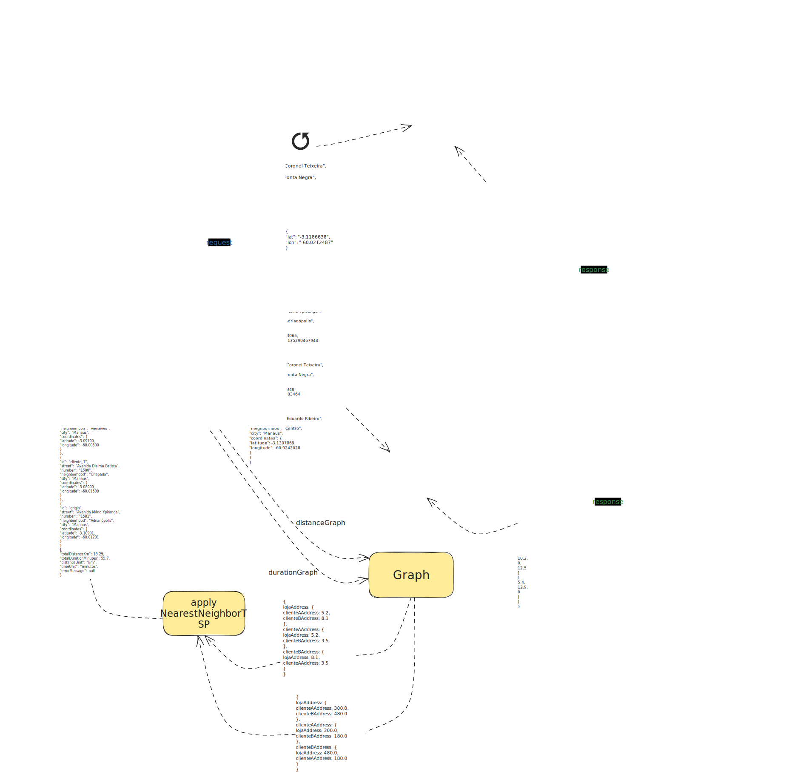

# Delivery Route Optimization Service

Serviço para otimização de rotas de entrega, construído com Spring Boot e programação reativa. O serviço recebe um ponto de origem e múltiplos destinos, e retorna uma sequência otimizada de paradas para minimizar a distância total da viagem, resolvendo uma versão do **Problema do Caixeiro Viajante (TSP)**.

## Sobre o Projeto

Este serviço foi projetado para resolver um desafio logístico comum: encontrar a rota mais eficiente para realizar múltiplas entregas. Ele utiliza uma arquitetura moderna e reativa para garantir alta performance e escalabilidade.

Suas principais funcionalidades incluem:

* **Geocodificação:** Converte endereços textuais em coordenadas geográficas usando a API do **[LocationIQ](https://locationiq.com/)**. Inclui lógica de resiliência com retentativas e controle de limites de taxa.
* **Matriz de Distância/Duração:** Calcula a distância e o tempo de viagem entre todos os pontos usando a API do **[OpenRouteService](https://openrouteservice.org/)**, considerando diferentes perfis de rota.
* **Otimização de Rota:** Aplica o algoritmo heurístico do **Vizinho Mais Próximo (Nearest Neighbor)** para determinar a ordem de visitação mais curta.
* **Cache de Alta Performance:** Utiliza **Redis** para armazenar em cache os resultados da geocodificação e das matrizes de rotas, reduzindo drasticamente o tempo de resposta para requisições repetidas e diminuindo a dependência de APIs externas.
* **API RESTful:** Expõe um endpoint simples para receber os dados e retornar a rota otimizada em formato JSON.

-----

## Tecnologias Utilizadas

* **Java 21** & **Spring Boot 3**
* **Project Reactor** (Programação Reativa) & **Spring WebFlux**
* **Gradle**
* **Docker** & **Docker Compose**
* **Redis** (Para Caching)
* **LocationIQ API** (Geocodificação)
* **OpenRouteService API** (Matriz de Rotas)

-----

## Como Começar

Siga os passos abaixo para configurar e executar o projeto.

### Pré-requisitos

* **Git**
* **JDK 21** ou superior
* **Docker** e **Docker Compose**
* **Chaves de API** válidas para [LocationIQ](https://locationiq.com/) e [OpenRouteService](https://openrouteservice.org/)

### Executando com Docker

1.  **Clone o repositório** e entre na pasta:

    ```sh
    git clone https://github.com/EduardoRez3nde/delivery-route-optimization-service.git
    cd delivery-route-optimization-service
    ```

2.  **Crie o arquivo de segredos `.env`** na raiz do projeto e adicione suas chaves de API:

    ```
    LOCATIONIQ_API_KEY=SUA_CHAVE_AQUI_DO_LOCATIONIQ
    ORS_API_KEY=SUA_CHAVE_AQUI_DO_OPENROUTESERVICE
    ```

3.  **Inicie os serviços** com Docker Compose:

    ```sh
    docker compose up -d --build
    ```

    O serviço estará disponível em `http://localhost:8080`.


-----

## Uso da API

### Endpoint

`POST /routes/optimize`

### Exemplo de Requisição

```json
{
  "profile": "driving-car",
  "origin": {
    "street": "Avenida Mário Ypiranga", 
    "number": "1300", 
    "neighborhood": "Adrianópolis", 
    "city": "Manaus"
  },
  "destinations": [
    {
      "street": "Avenida Coronel Teixeira",
      "number": "5705", 
      "neighborhood": "Ponta Negra", 
      "city": "Manaus"
    },
    { 
      "street": "Avenida Eduardo Ribeiro", 
      "number": "659", 
      "neighborhood": "Centro", 
      "city": "Manaus"
    }
  ]
}
```

### Exemplo de Resposta de Sucesso (200 OK)

```json
{
    "routeOptimized": [
        {
            "id": "origin",
            "street": "Avenida Mário Ypiranga",
            "number": "1300",
            "neighborhood": "Adrianópolis",
            "city": "Manaus",
            "coordinates": { "latitude": -3.10413, "longitude": -60.01135 }
        },
        {
            "id": "client_2",
            "street": "Avenida Eduardo Ribeiro",
            "number": "659",
            "neighborhood": "Centro",
            "city": "Manaus",
            "coordinates": { "latitude": -3.13078, "longitude": -60.02420 }
        },
        {
            "id": "client_1",
            "street": "Avenida Coronel Teixeira",
            "number": "5705",
            "neighborhood": "Ponta Negra",
            "city": "Manaus",
            "coordinates": { "latitude": -3.07418, "longitude": -60.08834 }
        },
        {
            "id": "origin",
            "street": "Avenida Mário Ypiranga",
            "number": "1300",
            "neighborhood": "Adrianópolis",
            "city": "Manaus",
            "coordinates": { "latitude": -3.10413, "longitude": -60.01135 }
        }
    ],
    "metric": {
        "distanceTotalKm": 24.8,
        "timeTotalMinutes": 31.5,
        "unitDistance": "km",
        "unitTime": "minute"
    }
}
```

-----

## Fluxo da Arquitetura



O processo de uma requisição segue os seguintes passos:

1.  **Controller:** O `RouteController` recebe a requisição HTTP POST.
2.  **Service de Otimização:** O `RouteOptimizationService` orquestra o fluxo principal.
3.  **Geocodificação (com Cache):** Para cada endereço, o `GeocodingService` primeiro verifica se o resultado já existe no **cache do Redis**. Se sim (cache hit), o dado é retornado instantaneamente. Caso contrário (cache miss), a API do LocationIQ é consultada sequencialmente, e o resultado é salvo no cache para futuras requisições.
4.  **Cálculo da Matriz (com Cache):** Com as coordenadas em mãos, o `OrsMatrixService` também verifica o **cache do Redis** primeiro. Se a matriz para essa combinação de pontos não existir, ele faz a chamada ao OpenRouteService e salva o resultado no cache.
5.  **Algoritmo TSP:** O `RouteOptimizationService` constrói os grafos e aplica o algoritmo do Vizinho Mais Próximo.
6.  **Resposta:** O `RouteController` retorna a rota final e as métricas totais como uma resposta JSON.

-----

## Roadmap (Próximos Passos)

* [x] Adicionar um cache com Redis para resultados de geocodificação e matriz de rotas.
* [ ] Implementar algoritmos de otimização mais avançados (ex: Recozimento Simulado, Google OR-Tools).
* [ ] Integrar dados de trânsito em tempo real para estimativas de tempo mais precisas.
* [ ] Estender para otimização com múltiplos veículos e janelas de tempo de entrega.
* [ ] Criar uma interface de usuário (frontend) para visualizar a rota em um mapa.

-----

## Licença

Distribuído sob a Licença MIT. Veja o arquivo `LICENSE` para mais informações.

-----

## 🧑‍💻 Autor

[Eduardo Rezende](https://github.com/EduardoRez3nde)
